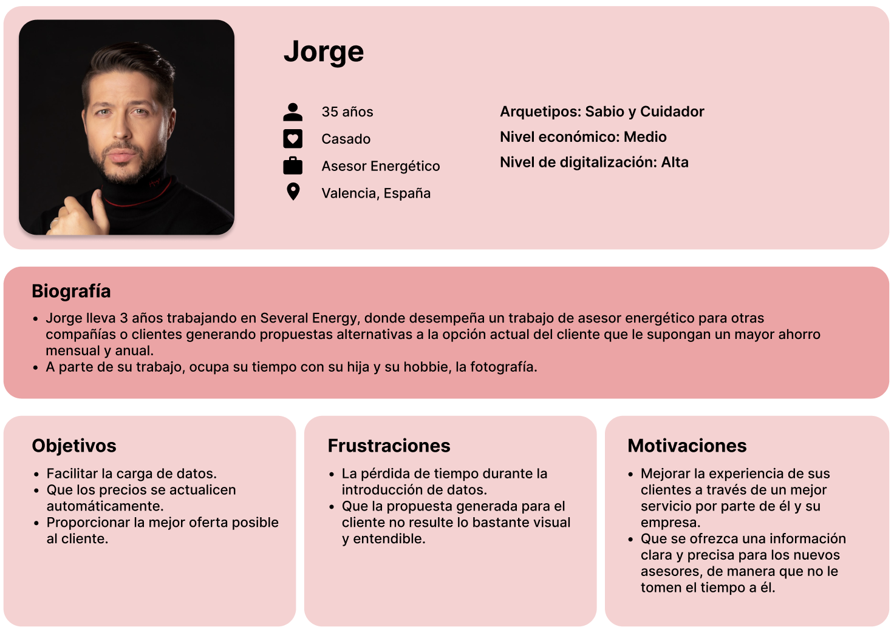
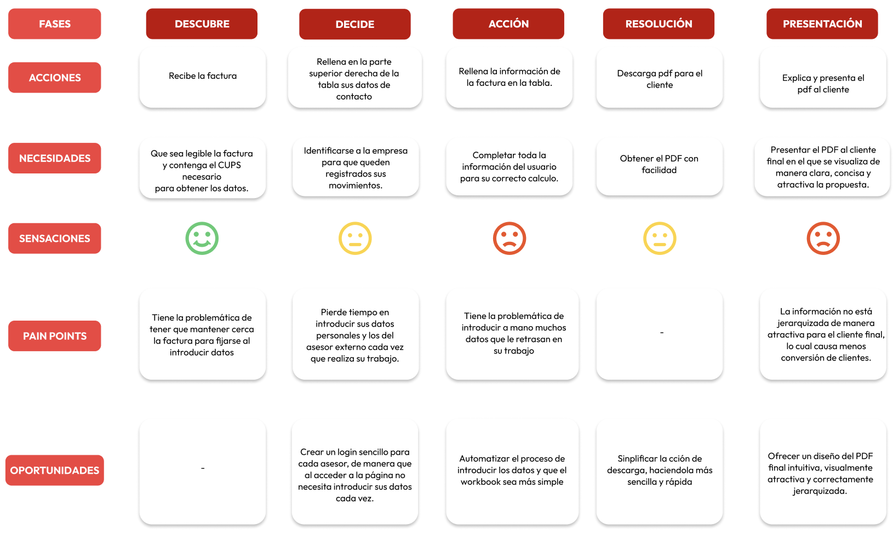
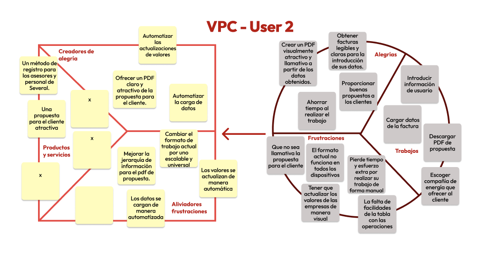
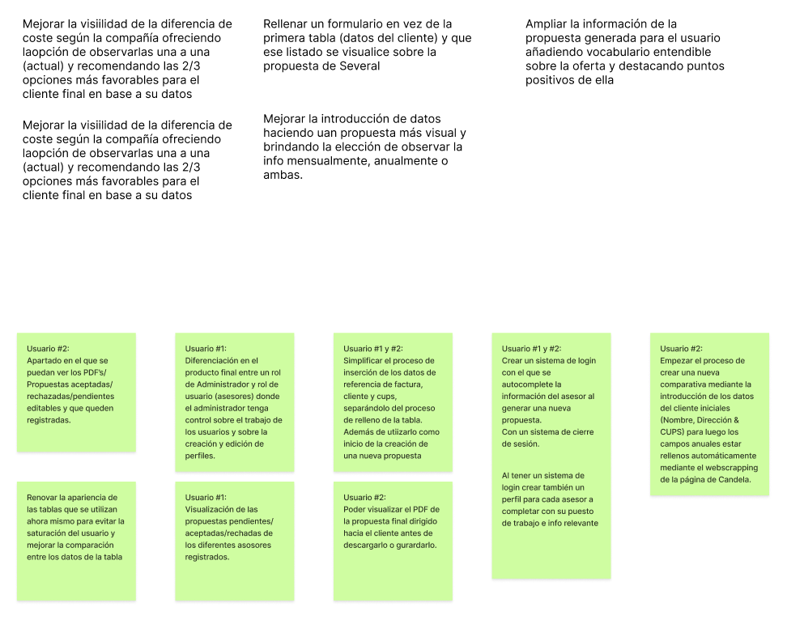
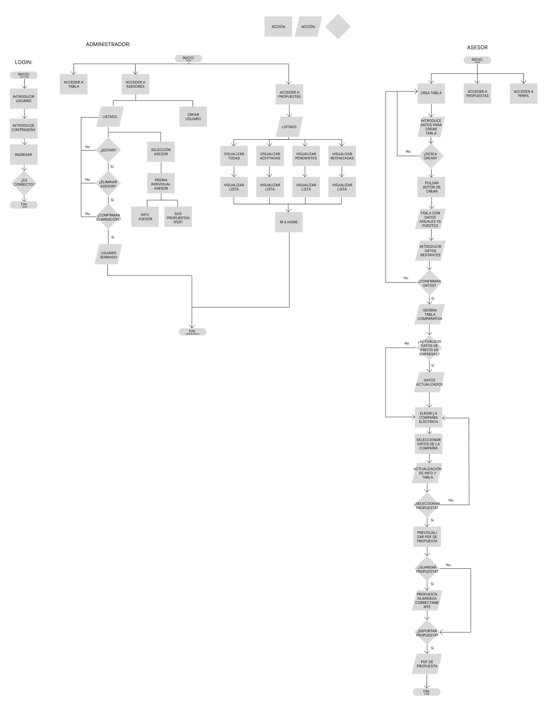
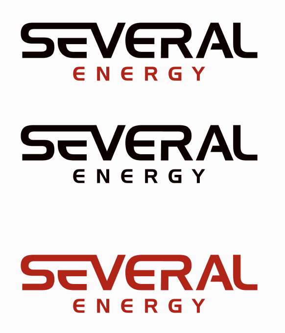
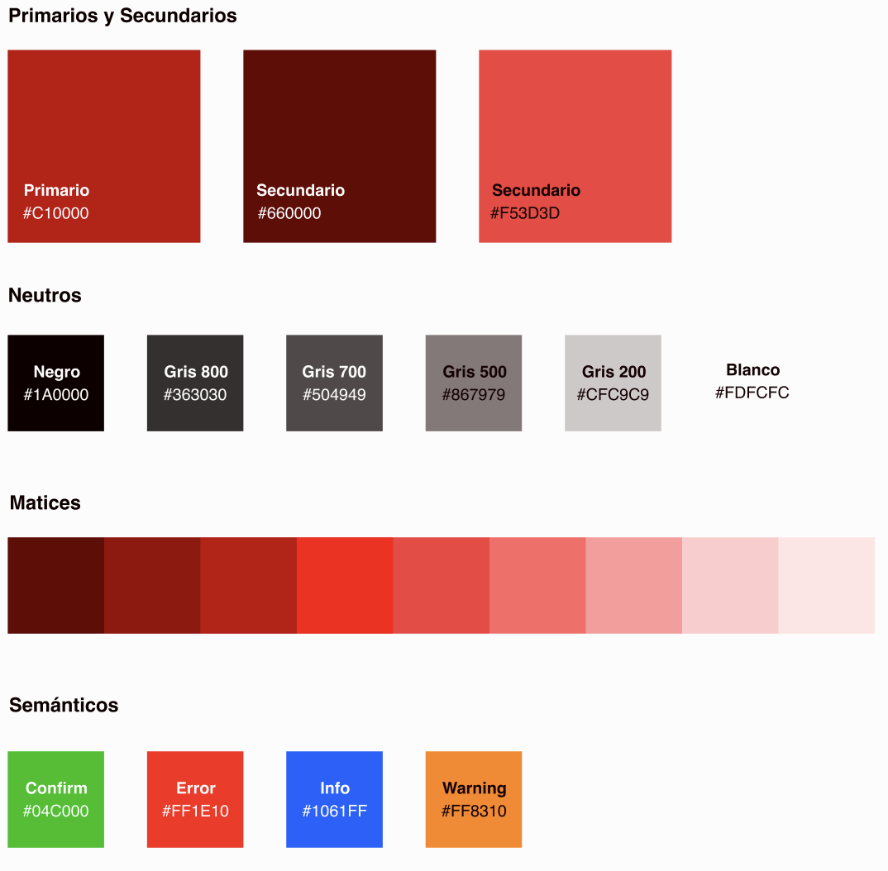
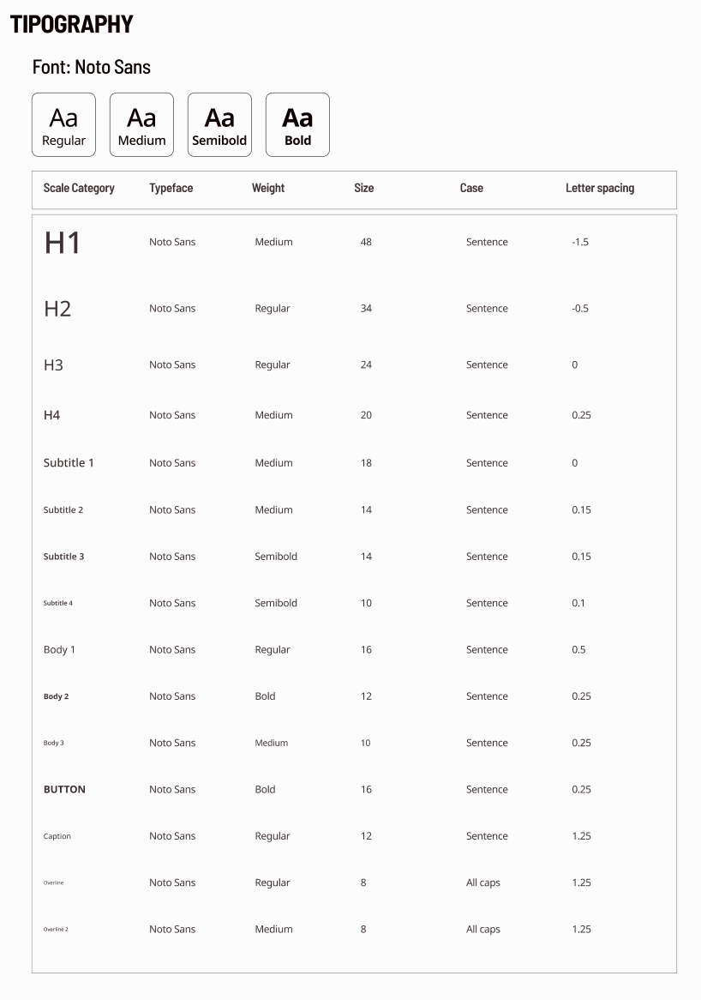

# Documentación de Diseño de Producto Digital UX/UI

---

## Descubrimiento
**Problemática**
- ¿Cómo podríamos virtualizar y automatizar todo lo posible para ahorrar tiempo de generación de la propuesta para el cliente?
- ¿Cómo podríamos solventar las limitaciones en el uso del workbook cuando se usa de manera externa?
- ¿Cómo podríamos simplificar el uso del workbook y mejorar el entendimiento de la propuesta destinada al cliente?

**Target**
Asesores internos de Several y asesores externos pertenecientes a compañías energéticas que trabajan con el workbook y generan las propuestas para el cliente

**Benchmark**
- Tarify
Al realizar la comparativa de empresas te recomienda la lista de opciones, la mejor opción resaltada al igual que la más eco.

- CNMC
Completas un formulario sobre los datos de tu consumo actual y se compara el listado de esos datos con otras opciones del mercado

-Compare the market
Representa la información de gastos de manera más visual. Opción de visualizar la información mensual o anual de manera intuitiva. Al presentar las empresas posibles, existe desplegable para visualizar mas detalles y permite filtrar la búsqueda dependiendo de sus preferencias.

-Selectra
Características de la oferta con sus puntos buenos y malos planteados de manera entendible para el usuario

**Insight de entrevista**
- No desea modificaciones en el orden de las tablas ya que le resulta familiar y cómodo.
- Las tablas no pueden ordenarse en base a la aparición de los datos en las faturas ya que dependiendo de la comercializadora podrá cambiar el orden.
- Mejorar la visibilidad de la diferencia de coste cambiando de compañía ya que ahora mismo para ver el cambio debe hacerse observando una por una.
- Que sea más visible para todos la información de las empresas para no perder el tiempo contestando llamadas.
- Mejorar el orden y la importancia de los datos en la propuesta generada para el cliente para conseguir una mejor visualización que ayude a dar una explicación con mayor facilidad sobre los datos que más interesan a los clientes.
- Simplificar el cálculo del consumo anual automatizando el proceso de introducción de datos para ahorrar tiempo y simplificar la tarea.
- Automatizar la entrada de datos en la tabla de personalización de precios para su actualización al sufrir un cambio.

**User persona**

**User Journey**

---

## Estrategia
**Value Proposition Canvas**

**Propuesta de valor**
Ofrecer  un método de trabajo óptimo y eficiente  para la labor de asesoría energética fomentando un procedimiento actualizado y moderno reduciendo así las complicaciones actuales de los trabajadores.

**Modelo de negocio**
El modelo de nogocio actual es un B2B (Bussines to Bussines) ya que sus ganancias se deben a los servicios que realizan para otras empresas del ámbito eléctrico y similares.
---

## Ideación ##
**Brainstorming**

---

## Conceptualización
**Flujos de usuario**

---

## Diseño
**Imágen de marca**

Logotipo:

Colores:

Tipografía:

---

## Interacción
[Prototipo funcional en Figma](https://www.figma.com/proto/jPe0uobZaYALSOcjr8AGkm/Desaf%C3%ADo-Tripulaciones---Grupo-4?type=design&node-id=922-8739&t=TyYhot5r1ZOg2VFU-1&scaling=scale-down&page-id=933%3A5889&starting-point-node-id=922%3A8739&mode=design)
